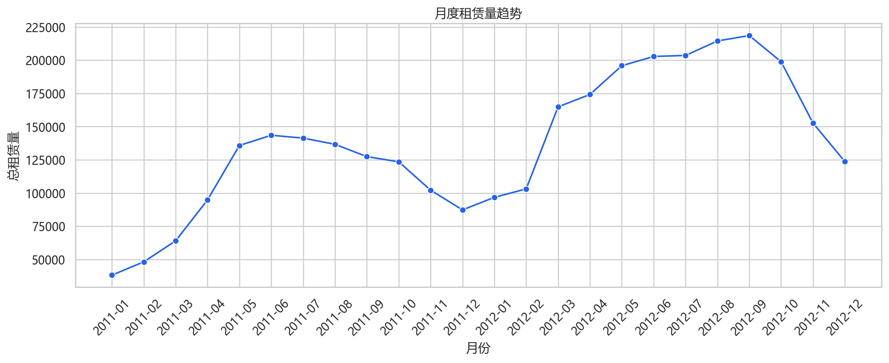
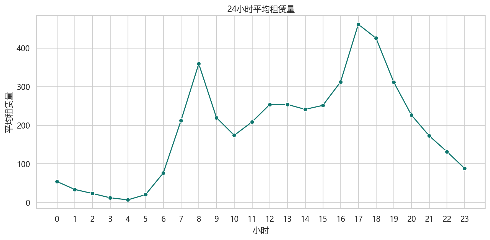
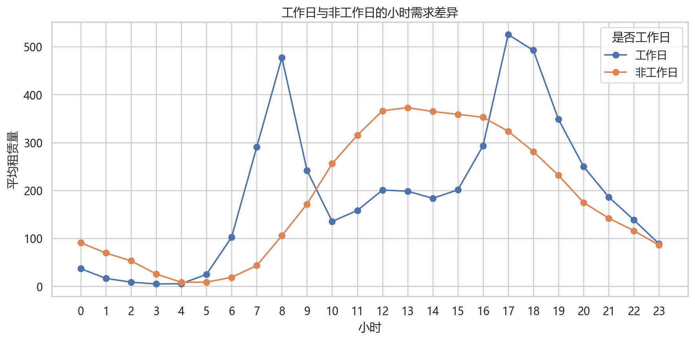
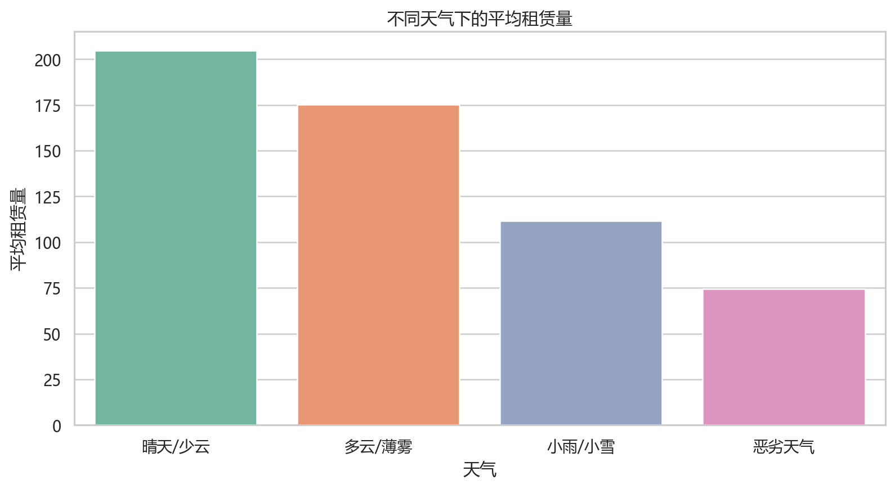
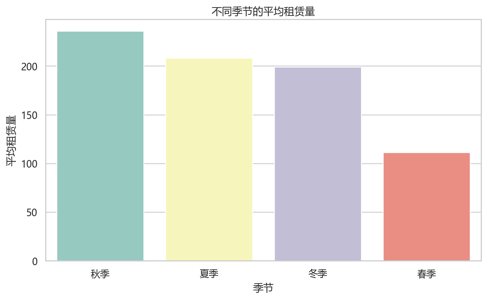
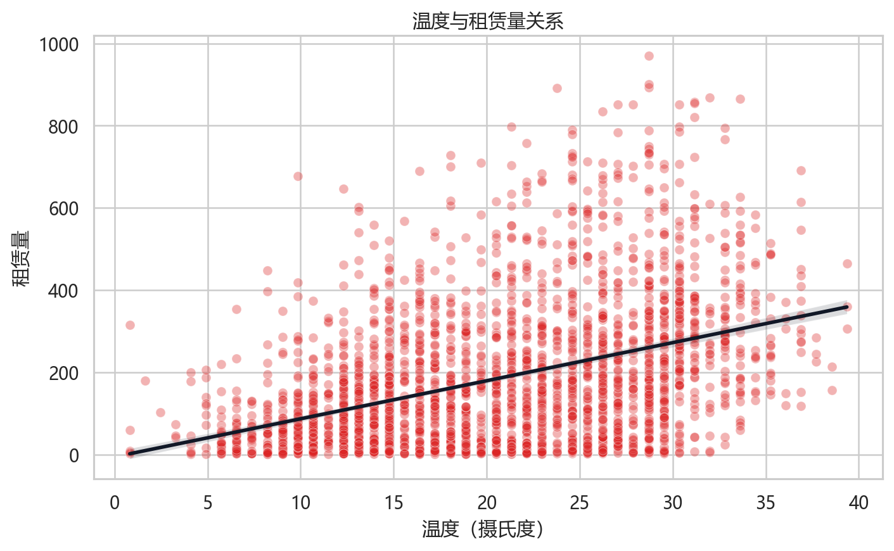
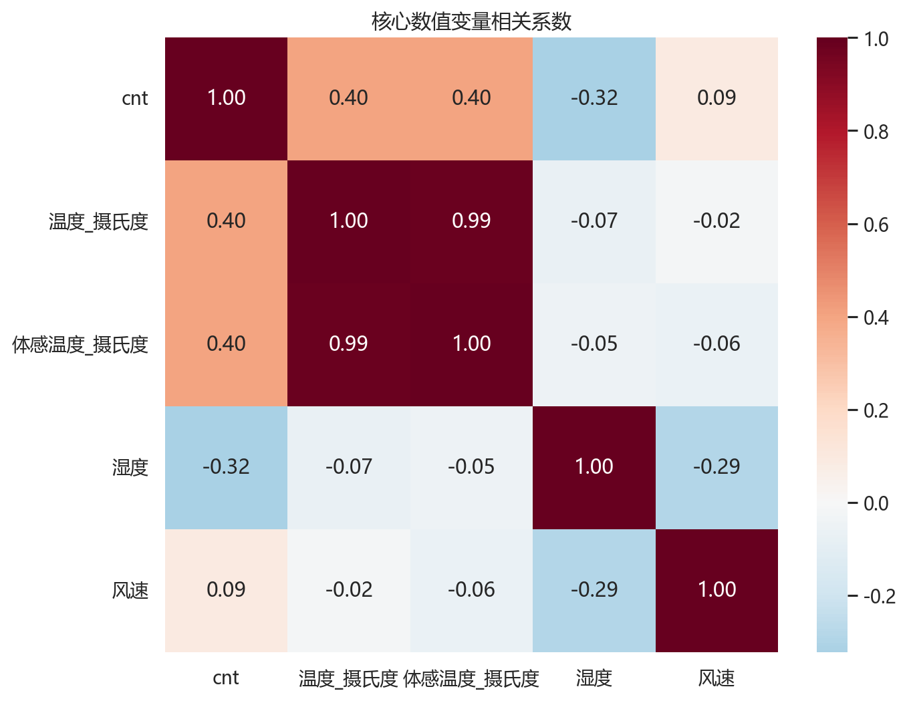
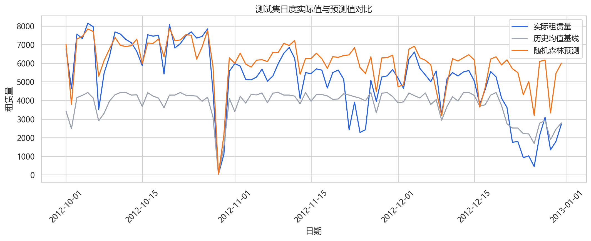
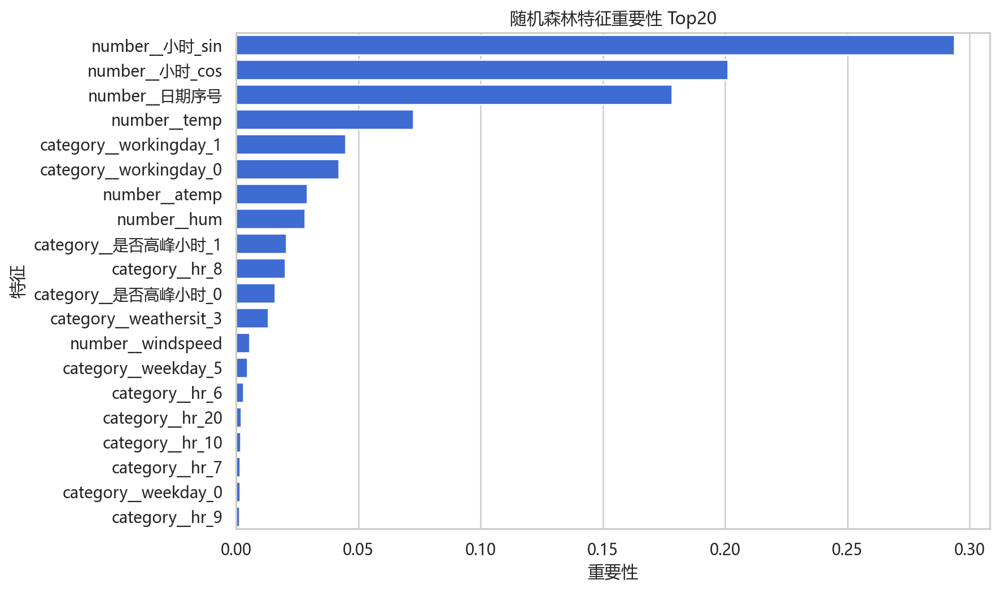

# 共享单车需求预测与运营分析

## 项目来源

数据来源为 UCI Bike Sharing Dataset 的小时级租赁数据，原始文件为 `hour.csv`。本发布版保留分析脚本、Notebook、聚合结果表和图表，不重复上传原始数据集。

| 项目项 | 内容 |
|---|---|
| 数据主题 | 共享单车小时级租赁记录 |
| 时间范围 | 2011-01-01 至 2012-12-31 |
| 记录数 | 17,379 |
| 总租赁量 | 3,292,679 |
| 小时平均租赁量 | 189.46 |

## 项目背景

共享单车运营需要根据时间、天气、季节和工作日差异提前安排车辆调度。本项目先分析需求规律，再构建小时级租赁量预测模型，为高峰补车、天气调度和资源配置提供依据。

## 分析思路

1. 读取小时级租赁数据并完成字段解释、日期拆分和类别映射。
2. 分析月度趋势、24 小时需求、工作日与非工作日差异。
3. 拆解天气、季节、温度、湿度、风速与租赁量的关系。
4. 构建历史均值基线、线性回归和随机森林模型。
5. 对比 MAE、RMSE、R2，并用特征重要性解释模型结果。

## 操作过程

### Python

```bash
pip install -r requirements.txt
python src/共享单车需求预测与运营分析.py
```

脚本会生成 `data/tables/` 中的统计表和 `images/` 中的图表。若要复现建模结果，需要将 UCI 原始 `hour.csv` 放到脚本指定的数据路径，或按脚本参数修改路径。

### Jupyter

Notebook 位于 [`notebooks/共享单车需求预测与运营分析.ipynb`](notebooks/共享单车需求预测与运营分析.ipynb)，适合逐步查看探索性分析、模型训练和结果解释。

## 模型结果

| 模型 | MAE | RMSE | R2 |
|---|---:|---:|---:|
| 历史均值基线 | 76.7629 | 116.9196 | 0.6636 |
| 线性回归 | 89.2809 | 121.5400 | 0.6365 |
| 随机森林 | 62.3261 | 105.2536 | 0.7274 |

随机森林效果最好，说明租赁需求与时间、天气、季节等因素存在明显非线性关系。

## 图表展示



















## 主要结论

- 平均需求最高时段为 17 点，符合下班通勤高峰特征。
- 晴天或少云天气下平均租赁量最高，恶劣天气会明显压低骑行需求。
- 秋季平均需求最高，季节因素对租赁需求有明显影响。
- 注册用户贡献了 81.17% 的租赁量，说明稳定通勤是核心场景。
- 运营上可在 7-8 点、17-18 点前进行重点补车，并将天气预报纳入调度计划。

